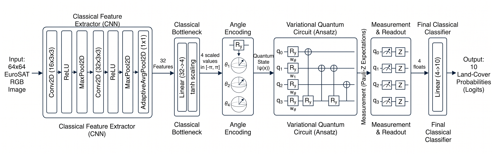

## **The Dimensionality Crisis (The Information Bottleneck)**
* A standard RGB image from the EuroSAT dataset is $64 \times 64$ pixels with $3$ color channels.
* Total features $\rightarrow$ $64 \times 64 \times 3 = 12,288$ classical values.
* Current NISQ-era quantum simulators (and physical hardware) can only handle a small number of qubits before simulation times explode.
* If we use Angle Encoding (one feature per qubit) $\rightarrow$ we can only pass $n$ features into an $n$-qubit circuit.
* We cannot feed $12,288$ features into a $4$-qubit circuit. We have to map $\mathbb{R}^{12288} \to \mathbb{R}^4$

## **Proposed Solution: Classical Feature Extraction Before Quantum Processing**

### **1. Classical Feature Extractor**
* Use Classical CNN as preprocessor to extract high-level features:
    * Covolution, pooling, Activation layers will process $64 \times 64$ input image and flatten it to $32$ features.
        1. **`Conv2D` (2D Convolution Layer)**:
            * Convolution layers apply a set of learnable "filters" (or kernels) across the input image.
            * Kernel slides over the image $\rightarrow$ performs mathematical (convolution) operation $\rightarrow$ highlights areas where the pattern is strong $\rightarrow$ creates a "feature map" where high values indicate the pattern's presence
            * We stack multiple `conv2D` layers:
                * Early layers learn to detect simple edges and textures
                * Deeper layers combine these simple features to detect increasingly complex / abstract patterns (like parts of objects and then eventually whole objects)

        2. **`ReLU` (Rectified Linear Unit)**:
            * Non-linear activation function applied after each convolution
            * Formula: $f(x) = max(0, x)$
        
        3. **`MaxPool2D` (2D Max Pooling Layer)**:
            * Downsamples the spatial dimensions of the feature maps (width and height)
                * Reduces the amount of computation in deeper layers
                * Prevents overfitting $\rightarrow$ encourages the network to learn general patterns + features instead of specific, potentially noisy pixel details $\rightarrow$ improves generalizatiom
            * Translational Invariance: Makes the network robust to small translations / shifts in the input image (e.g. if the object of interest appears in a slightly different position in the image, max pooling helps the network still recognize it) because max signal is picked up even with small shifts

        4. **`AdaptiveAvgPool2D` (2D Adaptive Average Pooling Layer)**:
            * Standard pooling layers downsample based on defined windows $\implies$ output size varies with input image dimensions. 
            * However, before passing the feature vector to the final classification layers (the fully connected logic at the very end), we need a standardized, fixed output size. This issue is solved by adaptive average pooling.
            * Standardizing Output Size: Unlike standard pooling, `AdaptiveAvgPool2D` allows us to specify the exact output dimensions we want (e.g., $1 \times 1, 2 \times 2$).
            * How it Works: 
                * The layer automatically calculates the pooling window and stride needed to achieve that specific target outpu t size
                * Then, it averages all the feature map values for each channel to produce that shape
    
    * This sequence (`Conv2D` -> `ReLU` -> `MaxPool2D`) is repeated multiple times because it's a fundamental building block for hierarchical feature learning. 
        * Each stacked block operates on a progressively smaller (due to pooling) but more abstract and semantically rich (due to deeper convolution/ activation layers) version of the feature map
        * Each pooling layer standardises + reduces complexity + adds invariance at each level of feature abstraction. 
        * Finally, `AdaptiveAvgPool2D` enforces the consistent output shape required for the classification layers or even a VQC!

### **2. Classical Bottleneck + Quantum Scaling**
1.  A final classical Linear layer (the bottleneck) compresses this vector down to exactly $n$ neurons, matching the number of qubits.

2.  #### **The Quantum Scaling Function ($\tanh$ translation)**
    * Once the CNN extracts the $4$ features, we face a **mathematical translation problem**:
        * Classical neural network outputs are often unbounded (e.g., after a linear layer) or strictly positive (after a ReLU). 
        * However, quantum gates operate on angles (radians).
        * Because quantum rotations are periodic; an angle of $0$ and an angle of $2\pi$ result in the exact same quantum state.
        * Example:
            * If the classical CNN outputs a value of $3.14$ $\approx$ $\pi$ $\implies$ the qubit rotates halfway around the sphere. 
            * If the CNN outputs $9.42$ $\approx$ $3\pi$ $\implies$ the qubit spins around one and a half times and ends up in the exact same position. 
        * This periodicity completely breaks classical gradient descent if values aren't strictly bounded.
    * **Solution:** Before the classical values hit the quantum circuit $\rightarrow$ we must mathematically squash them into a safe rotational range $\rightarrow$ typically $[-\pi, \pi]$.
        * We achieve this by passing the bottleneck vector $x$ through a Hyperbolic Tangent ($\tanh$) activation function, which maps all values to $[-1, 1]$; and then multiplying by $\pi$:

        $$x_{quantum} = \tanh(x_{classical}) \times \pi$$

        * This guarantees that no matter how aggressively the classical optimizer updates the weights, the resulting rotation fed into the quantum circuit will always represent a unique, non-repeating coordinate on the Bloch sphere.

### **3. State Preparation (Angle Encoding)**
* Now that we have $n$ safely bounded floats $\rightarrow$ we must initialize the quantum state.
* This step is officially called **State Preparation** or **Quantum Embedding**.
* Since qubits start in the default ground state $|0\rangle$ (the "resting" state where no energy is added) $\implies$ we use **Angle Encoding** to load the data.
* We apply a $Y$-axis rotation gate ($R_y$) to each individual qubit, using our classical floats as the angle $\theta$.
* Mathematically, the tensor product ($\otimes$) of these independent rotations builds the initial quantum state vector $|\psi(x)\rangle$:

$$|\psi(x)\rangle = \bigotimes_{i=1}^n R_y(x_i) |0\rangle$$

* **Why $R_y$ and not $R_x$ or $R_z$?**
    * **$R_z$**: changes the relative phase of the qubit. If a qubit is at $|0\rangle$ (the North pole), spinning it around the Z-axis does absolutely nothing to the measurable probabilities. It just spins in place.
    * **$R_y$**: rotates the state vector along the real plane from the North pole ($|0\rangle$) toward the South pole ($|1\rangle$). This explicitly alters the probability amplitude of the state in a way that is immediately useful for real-valued image data.

### **4. (Alternative) Amplitude Encoding (And Why We Avoid It Here)**
* **Amplitude Encoding** packs the features directly into the complex probability amplitudes ($\alpha, \beta$) of the quantum state $\leftarrow$ [ instead of using $n$ qubits to encode $n$ features via angles ] 
    * Because an $n$-qubit system has $2^n$ amplitudes $\implies$ you can encode a massive amount of data into very few qubits (e.g., $10$ qubits can hold $1,024$ features).

    $$|\psi(x)\rangle = \sum_{i=1}^{2^n} x_i |i\rangle$$
    
* **The Catch for NISQ:** 
    * Preparing this highly compressed state requires an incredibly deep, complex quantum circuit just to load the data before any actual "learning" even begins.
    * On current hardware, the noise from this deep preparation circuit destroys the data before the model can process it. 
* Angle encoding is much less dense, but it requires a circuit depth of exactly $1$ to load the data $\rightarrow$ highly robust to NISQ-era noise.
