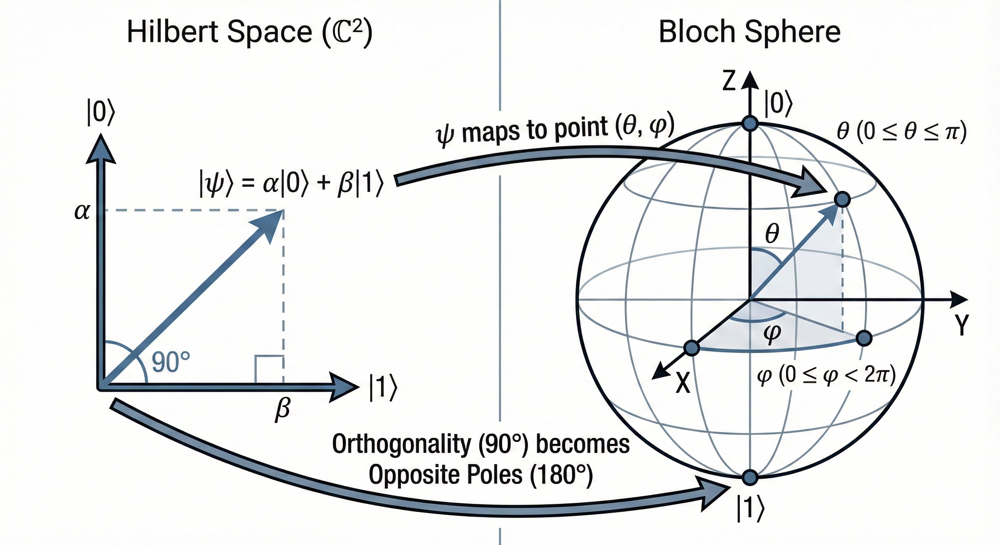

## **1. The Quantum State & Qubits**

In classical computing:
* Information is deterministic and discrete
* A bit is a scalar value: exactly $0$ or $1$.

In quantum computing:
* A quantum bit (qubit) is fundamentally different
* Qubit is a 2D complex vector
* The state of a single qubit is represented as:  

$$|\psi\rangle = \alpha|0\rangle + \beta|1\rangle$$

* Where:
    * $|\psi\rangle$ is the state vector $\rightarrow$ denotes state of the qubit
    * $|0\rangle$ and $|1\rangle$ are the computational basis states → similar to classical bits
    * $\alpha$ and $\beta$ are complex numbers known as "probability amplitudes"
    * $|\alpha|^2$ is the probability of measuring the qubit in the $|0\rangle$ state
    * $|\beta|^2$ is the probability of measuring the qubit in the $|1\rangle$ state

* Common misconception $\rightarrow$ qubit is "both $0$ and $1$ at the same time" 
* It is more accurate to say qubit exists in a defined, continuous mathematical space mapped across those basis states

* The only strict rule $\rightarrow$ normalization constraint (the total probability must equal 1):

$$|\alpha|^2 + |\beta|^2 = 1$$

### **NOTE : Bloch Sphere**
* It is a geometric representation of the state space of a single, pure quantum bit
* Instead of thinking of a qubit as just an array of two complex numbers, you can visualize it as a vector pointing from the center of a sphere to its surface
* Components:
    * The Poles (Basis States)
        * North pole represents the classical state $|0\rangle$
        * South pole represents the classical state $|1\rangle$
    * The Surface (Superposition): Every single point on the surface of the sphere represents a valid quantum state in superposition.
    * The Angles: The state vector is defined by two angles:
        * $\theta$ (Theta): The polar angle (latitude), mapping the probability distribution between $|0\rangle$ and $|1\rangle$.
        * $\phi$ (Phi): The azimuthal angle (longitude), representing the relative phase of the quantum state.
    * The Math: This geometry maps perfectly to the generalized qubit equation:

    $$|\psi\rangle = \cos\left(\frac{\theta}{2}\right)|0\rangle + e^{i\phi}\sin\left(\frac{\theta}{2}\right)|1\rangle$$

* When a quantum computer is "idle" $\rightarrow$ the qubits generally rest at the North pole ( $|0\rangle$ )
* To encode classical data or process information, we use quantum gates to rotate that vector around the $X$, $Y$, or $Z$ axes of this sphere.

### **NOTE: Superposition**
Core idea $\rightarrow$ superposition is the quantum mechanical principle that allows a system to exist in multiple states simultaneously until it is measured

In QML $\rightarrow$ superposition is the mechanism that allows a quantum computer to map classical data into an exponentially large, high-dimensional feature space without requiring an exponentially large amount of physical memory.

#### **Math definition:**
* In a classical neural network $\rightarrow$ a single node holds exactly one activation value (e.g., $0.45$).
* In a quantum neural network $\rightarrow$ a single qubit holds a state vector $|\psi\rangle$ that is a linear combination of its basis states: 

$$|\psi\rangle = \alpha|0\rangle + \beta|1\rangle$$

* When you scale this up to $n$ qubits $\rightarrow$ the system does not just scale linearly; it scales exponentially. 
* A register of $n$ qubits exists in a superposition of $2^n$ possible basis states simultaneously.
* For example:
    * A 3-qubit system has $2^3 = 8$ basis states ( $|000\rangle, |001\rangle, |010\rangle, \dots, |111\rangle$ ).
    * Its combined state vector is written as: 

    $$|\Psi\rangle = c_0|000\rangle + c_1|001\rangle + c_2|010\rangle + \dots + c_7|111\rangle$$

    * Where: 
        * $c_i$ are the complex probability amplitudes
        * The sum of their squared magnitudes equals 1.

#### **How does superposition give QML a massive advantage?**
* For a classical computer to represent those 8 states → it needs an 8-dimensional tensor (array)
    * To represent $50$ qubits → a classical computer would need an array of $2^{50}$ complex numbers; which exceeds the memory capacity of the world's largest supercomputers.

* Superposition gives QML two massive theoretical advantages:
    1. **Exponential Dimensionality (Amplitude Encoding)**: If you want to feed a 32-dimensional classical feature vector from your CNN into a quantum circuit, you do not need 32 qubits. Because $2^5 = 32$, you can theoretically encode all 32 classical features into the probability amplitudes of just 5 qubits existing in superposition.
    2. **Quantum Parallelism**: When your optimizer updates the weights of an Ansatz layer and applies a rotation gate, that single mathematical operation acts on the entire state vector. It modifies all $2^n$ amplitudes simultaneously in a single hardware instruction.

## **2. Observation & Measurement (Wavefunction Collapse)**
In classical ML:
* Observing a tensor during a forward pass doesn't alter its values

In quantum mechanics:
* Measurement is an active, destructive operation
* When you measure $|\psi\rangle$ → the superposition collapses 
    * You will never read out the complex numbers $\alpha$ or $\beta$
    * You will only ever measure the classical state $0$ (with probability $|\alpha|^2$) or $1$ (with probability $|\beta|^2$).  
* Because a single measurement yields just a binary bit → QML relies on "Expectation Values"
    * The circuit is executed and measured hundreds of times (called "shots")
    * We calculate the average measurement outcome with respect to an observable, typically the Pauli-Z matrix ($\sigma_z$).

    $$\langle \sigma_z \rangle = \langle \psi | \sigma_z | \psi \rangle$$

* This operation translates the probabilistic quantum state into a continuous classical float ranging from $-1$ to $1$
* This float is what gets passed forward into the classical fully connected layers of your hybrid network.

## **3. The Ansatz (Parameterized Quantum Circuits)**
* In classical deep learning → architectures are defined by layers, neurons, weight tensors, etc.
* In QML → the architecture is called the Ansatz (a parameterized quantum circuit).
    * An ansatz consists of a specific sequence of quantum gates.
    * Instead of updating a weight matrix, the classical optimizer (eg: Adam) updates the rotation angles ($\theta$) of the gates:
        * $R_x(\theta)$ , $R_y(\theta)$ , $R_z(\theta)$ → single-qubit gates that rotate the state vector around the Bloch sphere.
    * During backpropagation → the gradients of these angles are calculated (often using the parameter-shift rule); and the optimizer tweaks the angles to rotate the state vector closer to the decision boundary that minimizes the loss function.

## **4. Entanglement & Topologies**
* Single-qubit rotations → mathematically equivalent to independent linear transformations. 
* To capture relationships between features (like the spatial correlations between pixels in an image patch) → the qubits need to interact. 
* This is achieved via Entanglement; primarily using two-qubit operations like the CNOT (Controlled-NOT) gate.
    * CNOT gate flips a target qubit iff the control qubit is in the state $|1\rangle$. This inextricably links their probability amplitudes.
* Entanglement Strategies:
    * **None**: Qubits rotate independently. This reduces the quantum layer to a simple, uncoupled series of transformations.
    * **Basic (Ring Topology)**: Qubit $0$ is entangled with Qubit $1$; Qubit $1$ with Qubit $2$; and the final qubit loops back to entangle with Qubit $0$.
    * **Full Entanglement (Entangling Layer)**: Every qubit is entangled with every other qubit.  This maximizes the connectivity of the quantum circuit.

## **5. The Entanglement Paradox**
* Theoretically → high entanglement provides the "quantum advantage" → allows the model to represent incredibly complex functions in a high-dimensional Hilbert space.
* Empirically → this often completely backfires in early hybrid architectures → Entangling the qubits creates a highly non-convex, extremely rugged loss landscape filled with narrow ravines and barren plateaus (regions where gradients vanish exponentially). The classical optimizer simply gets lost in the entangled math.
* When you remove the entanglement (no CNOTs) → the model degrades into a smooth, independent mathematical structure. Classical optimizers navigate this smooth landscape effortlessly.

## **6. The NISQ Era & Hardware Limitations**
We are currently in the Noisy Intermediate-Scale Quantum (NISQ) era. Physical quantum hardware is highly susceptible to the environment.  
* **Decoherence**: Qubits randomly lose their state.
* **Gate Errors**: Every operation introduces a fraction of a percent of noise. Deep circuits (many ansatz layers) will eventually degrade the data into random static.